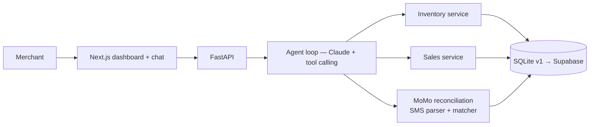

# Sahel Commerce AI 🌍

**AI-powered commerce assistant for West African informal merchants** — manage inventory, record sales, and reconcile mobile money payments (Orange Money / Moov Money) in plain French, through a conversational AI agent.

> Built by [Steeve Donald](https://github.com/dosteeve2-hash) — AI Automation Engineer focused on solving real African problems with intelligent agents.

**🔗 Live demo: [sahel-commerce-ai.vercel.app](https://sahel-commerce-ai.vercel.app)** — works standalone in browser demo mode; installable as a mobile app (PWA).

## Why this project

Millions of informal merchants across the Sahel run their business from a notebook and a phone. Sales happen in cash and mobile money, stock is tracked from memory, and reconciling Orange Money SMS receipts against actual sales is done by hand — or not at all.

Sahel Commerce AI turns that workflow into a single conversation:

```
Vous : vends 2 Savon Citec en orange money
Sahel : Vente enregistrée : 2 × Savon Citec = 1 200 FCFA (orange money). Stock restant : 38.

Vous : [colle ses SMS Orange Money]
Sahel : 3 transactions détectées, 2 rapprochées avec tes ventes.
        ⚠️ 1 paiement de 5 000 FCFA (Ref OM240701.9981) sans vente correspondante.
```

## Architecture



**Key design decisions**

- **Agentic core, not a chatbot wrapper.** The LLM drives a real tool-calling loop (`backend/app/agent/core.py`): it reads and writes business data through 7 typed tools, never invents numbers, and confirms every action.
- **Demo mode without an API key.** A rule-based intent fallback keeps the full stack testable offline — a deliberate choice for low-connectivity contexts (and live demos).
- **Mobile money reconciliation as a first-class feature.** Regex-based SMS parsing (Orange Money / Moov Money formats) + two-pass matching: exact reference, then amount + same-day.
- **SQLite first, Supabase next.** Zero-dependency start; the Postgres schema (`supabase/schema.sql`) is ready for the hosted migration.

## Stack

| Layer | Tech |
|---|---|
| Agent | Anthropic Claude (tool use), custom agent loop |
| API | FastAPI + Pydantic |
| Frontend | Next.js 14 (App Router), vanilla CSS |
| Data | SQLite (v1) → Supabase Postgres |
| Deploy | Vercel (frontend) + Render/Railway (API) |

## Quick start

```bash
# Backend
cd backend
pip install -r requirements.txt
copy .env.example .env        # add your ANTHROPIC_API_KEY (optional — demo mode works without)
python seed.py                # demo data
uvicorn app.main:app --reload # http://localhost:8000/docs

# Frontend (new terminal)
cd frontend
npm install
copy .env.local.example .env.local
npm run dev                   # http://localhost:3000
```

## Roadmap

- [x] v1 — Conversational agent, inventory, sales, MoMo reconciliation, dashboard
- [ ] WhatsApp channel (Twilio/Meta Cloud API) — meet merchants where they are
- [ ] Supabase migration + auth (multi-merchant)
- [ ] Voice input in French & Mooré
- [ ] Weekly AI-generated business insights ("your top margin product is…")

## License

MIT
